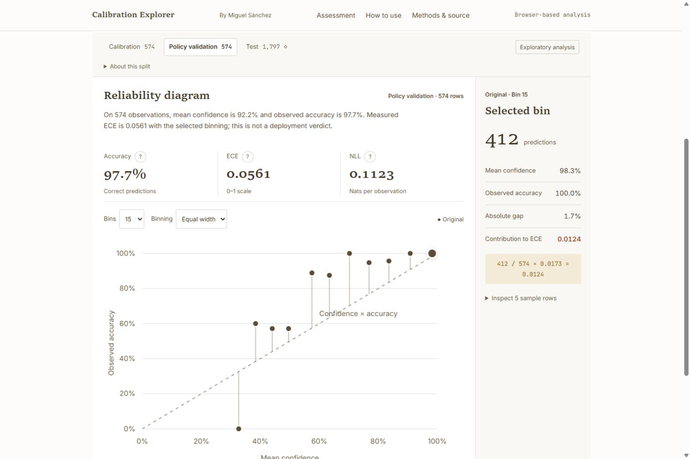

# Calibration Explorer

Calibration Explorer is for anyone with saved classifier predictions and known outcomes who wants to check whether the model's confidence matches how often it is correct, fit temperature scaling and export a report.

**Try it in the browser:** [open the workbench](https://huggingface.co/spaces/m-sanchez/calibration-explorer). It opens with a handwritten-digits example loaded, and your own CSV or JSON is processed in the browser.

**Try it from Claude Code:** add the [local MCP server](docs/mcp.md) for the directory you run this in, using two existing absolute directories. It needs Node.js 20 or newer.

```sh
claude mcp add calibration -- npx -y @m-sanchez/calibration-explorer-mcp@0.2.0 --input-root ABSOLUTE_PREDICTION_DIRECTORY --output-root ABSOLUTE_REPORT_DIRECTORY
```

<a href="https://huggingface.co/spaces/m-sanchez/calibration-explorer"></a>

[Website copy](https://miguelsanchez.co.uk/calibration-explorer/) · [Worked example](https://miguelsanchez.co.uk/writing/calibration-explorer-accuracy-and-confidence/) · [Numerical library](https://github.com/m-sanchez/calibrated)

The MCP server reads selected local files and saves reports directly into your project. The first client target is Claude Code interactive terminal 2.1.283. Raw inputs stay local by default; returned summaries can reach the client's model provider. `claude mcp add` stores the server in Claude Code's local scope for that directory, and `claude mcp remove calibration -s local` removes it. [Install from npm](docs/mcp.md#install-from-npm) has the session-only JSON configuration and the Claude Code plugin.

## Workflow

- **Inspect:** compare confidence and accuracy with reliability bins, ECE, and sample counts. Four controlled examples illustrate sampling variation, binning, temperature scaling, and different group distortions.
- **Calibrate:** fit one temperature using calibration logits. Confidence-only inputs support measurement, not temperature fitting or NLL.
- **Decide:** choose a threshold on separate policy-validation rows, lock temperature and threshold, then inspect test results.
- **Export:** save an HTML report, experiment JSON, or prediction CSV. Configuration links share settings without imported observations.

The app evaluates saved predictions; it does not train or run a classifier. It retains failed fits and preserves original results if scaled evaluation fails.

Follow the [short reference walkthrough](docs/reference-workflow.md) for the chart, calibration, policy and export sequence. Its linked audit records distinguish actual client/browser observations from scripted checks.

## Inputs

| Format | Required fields | Optional fields |
| --- | --- | --- |
| CSV | `id`, `confidence` in [0,1], `correct` as true/false or 1/0 | `split`, `group` |
| Logit JSON | `id`, finite `logits`, zero-based true `label`, `split` | `group` |

IDs must be unique across splits. Logit vectors must use a consistent class order and dimension. JSON accepts an array of rows or the versioned dataset object shown in the [template](public/templates/logits.json). Missing CSV splits become `exploration`; the other partitions are `calibration`, `policy_validation`, and `test`. See the [CSV template](public/templates/confidence.csv).

The [Python preparation recipes](docs/prediction-recipes.md) write both formats from explicit experiment arrays. Test-only files stay unopened until an explicit review choice. Browser report previews and downloads share one snapshot. Default JSON records require the matching input for reproduction; raw observations remain an explicit option. See the [browser/MCP exposure matrix](docs/exposure-matrix.md).

Limits are 5 MiB, 20,000 rows, 100 classes, and 1,000,000 logits. These are input caps, not performance guarantees.

## Run and verify

Install Node.js 24.9 or newer and Git. The numerical dependency is pinned to an exact public Git commit; no sibling checkout is required.

```sh
npm ci
npm test
npm run build
npm run preview -- --port 4173
```

Open http://127.0.0.1:4173. `npm run dev` starts the development server. Both servers bind to loopback.

With Python 3.11 or newer, verify the standard-library replay helper:

```sh
node scripts/create-review-evidence.ts
python -m unittest discover -s tests -p test_apply_temperature.py
```

CI runs the application tests, production build, and replay checks on Node 24 and 26. Tests cover import validation, split isolation, numerical fixtures, tied thresholds, escaped exports, privacy defaults, deterministic examples, and fit-failure recovery.

The [scenario audit](docs/usability/agent-audit.md) records five agent-led checks using generated inputs and a separate Python calculation of the digits results. It distinguishes module checks from browser observations and human usability research. Report confusing behaviour through the repository's usability feedback form using public or invented examples.

## Reference example

The bundled [UCI handwritten-digits predictions](public/examples/optdigits.json) come from a multinomial logistic-regression baseline. The original training set supplies 2,675 model-fit, 574 calibration, and 574 policy-validation rows; all 1,797 original test rows are retained.

| Test measure | Original | Temperature scaled |
| --- | ---: | ---: |
| Accuracy | 94.8804% | 94.8804% |
| NLL, nats per row | 0.17595188 | 0.15752643 |
| ECE, 15 equal-width bins | 0.03654895 | 0.01007906 |

The fitted temperature is approximately 0.72597839. At a fixed 80% threshold, scaled predictions accept 1,635 test rows, with 31 errors, and abstain on 162. This illustrative threshold was not optimised or recommended.

See the [assessment](review/digits-assessment.html), [experiment record](review/digits-experiment.json), [prediction CSV](review/digits-predictions.csv), and [data provenance](public/examples/README.txt). To regenerate the model predictions, use Python 3.11, install `scripts/requirements-reference.txt`, and run `python scripts/prepare_digits.py`. Source checksums, partitions, coefficients, and class order are recorded; numerical reproduction across environments uses tolerances.

## Privacy and interpretation

Imported files are processed in the browser without analytics or remote inference. Hosting still creates ordinary page requests. Raw inputs are not stored in browser storage; session storage retains test-inspection markers.

Default HTML and JSON omit observation rows, row IDs, and arbitrary imported provenance. Raw-data inclusion is explicit and includes all splits. Prediction CSV always contains rows from the selected split and slice; formula-like text receives a leading apostrophe. Aggregate bins and small groups can still reveal outcomes, so omission is not anonymisation.

ECE depends on binning and sample size. Synthetic reference quantiles are not pass/fail thresholds or bias corrections. Positive temperature preserves predicted classes, but calibration and acceptance outcomes can improve or worsen. Session locks cannot establish independent observations, unseen test data elsewhere, or deployment readiness. The training-derived reference partitions are not claimed to be writer-independent.

## Static Space build

After `npm run build`, run `node scripts/build-space.ts`. It verifies the current app, numerical build, and public assets, then writes a content-addressed payload under `.space-build/`. Upload the reported directory to the Space; it contains prebuilt assets, licenses, attribution, the Space card, and a hash manifest. The script does not upload anything.

The [social card](docs/assets/social-preview.png) is included. Its optional generator, `scripts/create-social-preview.mjs --help`, requires a separate installation of `satori` and `sharp` supplied through `--site`, Python `fontTools` with WOFF2 support, and local font files. It is not part of the application build.

## License

[MIT](LICENSE), Copyright (c) 2026 Miguel Sánchez Durán. The numerical library retains its own MIT notice. The [UCI reference](public/examples/README.txt) is attributed under CC BY 4.0. Self-hosted Inter and JetBrains Mono retain their [Inter](public/fonts/Inter-OFL.txt) and [JetBrains Mono](public/fonts/JetBrainsMono-OFL.txt) SIL Open Font License 1.1 notices.
