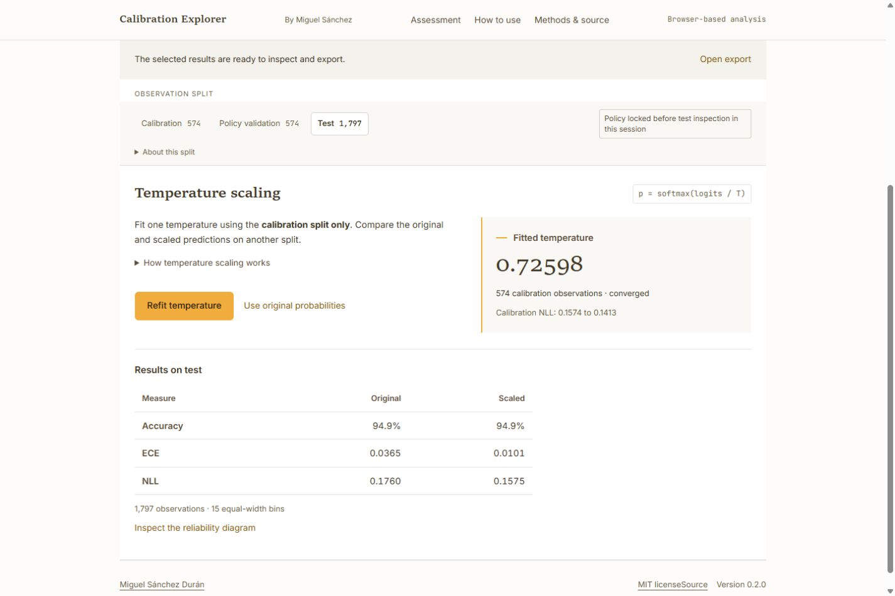

# Reference workflow: text walkthrough

Use **Explore a worked example** to load saved predictions from the handwritten-digit classifier. This short guide accompanies the [observed client workflow](usability/mcp-audit.md) and [browser checks](usability/release-0.2.0-audit.md). The same stages apply to your predictions after [preparing the input](prediction-recipes.md).

[Watch the 36-second capture](assets/reference-workflow-0.2.0/reference-workflow-step-by-step.webm) with [captions](assets/reference-workflow-0.2.0/reference-workflow-step-by-step.vtt) or [plain text](assets/reference-workflow-0.2.0/reference-workflow-text.txt). This silent step-by-step capture is assembled from six actual screenshots of the released interface; it is not a real-time recording. [Capture provenance and hashes](assets/reference-workflow-0.2.0/manifest.json) identify the exact release.

1. **Inspect.** Keep the observation split on **Policy validation**. Read the sample count and compare confidence with accuracy. Workflow stages and observation splits are separate controls. [Reference frame](assets/reference-workflow-0.2.0/01-reference.png).
2. **Inspect the chart.** Select a reliability point to update the linked bin details. In the published-app capture, original policy-validation bin 15 contained 412 rows. A bin result describes those observations, not the whole dataset. [Linked-bin frame](assets/reference-workflow-0.2.0/02-linked-bin.png).
3. **Calibrate.** Choose **Fit on calibration data**. The reference fits 574 calibration rows and returns temperature **0.72598**. Policy-validation and test rows are excluded from fitting. [Calibration frame](assets/reference-workflow-0.2.0/03-calibration.png).
4. **Decide.** Select an acceptance threshold on policy validation. The recorded demonstration uses **80%**, then locks that threshold and the fitted temperature. This is an illustrative choice, not an optimised or recommended threshold. [Locked-policy frame](assets/reference-workflow-0.2.0/04-policy-lock.png).
5. **Review test results.** Explicitly inspect the test split when ready. The reference has 1,797 test rows. If test results were inspected before the policy was locked, or the policy changes afterwards, the assessment remains exploratory. [Test-review frame](assets/reference-workflow-0.2.0/05-test-review.png).
6. **Export.** Preview the selected report, then choose **Share a report** for HTML, **Save assessment record** for JSON, or **Inspect prediction rows** for selected-split CSV. Reports can also be saved before test review. Default JSON requires its matching input for reproduction; including all source rows is a separate disclosure choice. [Export-preview frame](assets/reference-workflow-0.2.0/06-export-preview.png).

| Reference test measure | Original | Temperature scaled |
| --- | ---: | ---: |
| Accuracy | 94.8804% | 94.8804% |
| NLL | 0.17595188 | 0.15752643 |
| ECE, 15 equal-width bins | 0.03654895 | 0.01007906 |

At the illustrative 80% threshold, scaled predictions accept 1,635 test rows with 31 errors and abstain on 162. Accuracy stays the same because positive temperature preserves predicted classes. Confidence, NLL, ECE and threshold outcomes can change. These reference results do not establish performance on other data or prior test non-use.

For the same workflow without browser file transfer, follow the [local MCP instructions](mcp.md). The assistant reads the selected file, returns aggregate measurements and saves a local report; its summaries can enter the model provider's context.
